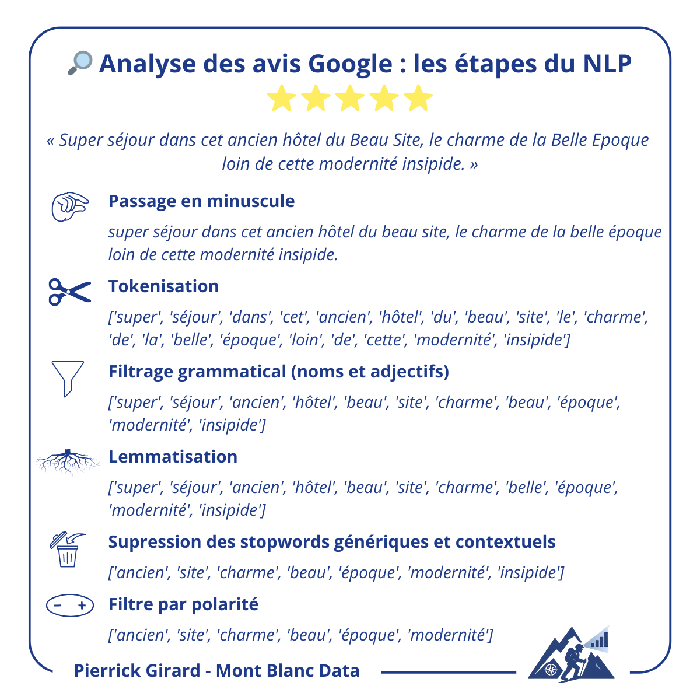

# Google Reviews → Insights NLP (Aix-les-Bains)

Ce projet montre comment **collecter** des avis Google sur l’hébergement touristique à Aix-les-Bains, puis **les analyser** via NLP pour en dégager des enseignements (points forts, irritants, tendances).  

Il a fait l’objet de **deux posts LinkedIn** : 
  1) collecte des données,
  2) analyse sémantique et insights.

---

## Aperçu

- **Collecte** : via les API Google Places (≤ 5 avis) et SerpAPI (> 5 avis).  
- **Analyse** :
  - normalisation (minuscule), tokenisation, lemmatisation,
  - filtrage grammatical (noms/adjectifs),
  - suppression des stopwords et termes contextuels,
  - filtrage par polarisation (on conserve les mots positifs pour les avis ≥ 4 et les mots négatifs pour les avis ≤ 3),
  - comptages, nuages de mots et regroupements thématiques (clustering).
- **Exports** : `list_places.xlsx`, `list_reviews.xlsx`, images des nuages **positif** / **négatif**.

**Rôle des fichiers**
- Le pipeline complet est orchestré via **`main.py`**.  
- La collecte/scraping et l’I/O sont dans **`scrap_data.py`**.  
- La préparation NLP, les lexiques, wordclouds et clustering sont dans **`analyze_nlp_data.py`**.

---

## Structure du projet

```
data/
├── input_json_data/
│   ├── location_airbnb_0.json
│   ├── location_airbnb_20.json
│   ├── location_curiste_0.json
│   ├── location_curistes_0.json
│   ├── location_meublé_0.json
│   ├── location_meublé_20.json
│   └── location_pour_curistes_0.json
└── output/
    ├── list_places.xlsx
    ├── list_reviews.xlsx
    ├── NUAGE_NEGATIF.png
    └── NUAGE_POSITIF.png

src/
├── analyze_nlp_data.py
├── main.py
├── scrap_data.py
├── setup_env.py
├── .gitattributes
├── .gitignore
└── README.md
```

---

## Installation & utilisation

1. **Env. Python** : créez un venv et installez les dépendances usuelles (`pandas`, `spacy`, `nltk`, `scikit-learn`, `wordcloud`, etc.).  
2. **Ressources linguistiques** : exécutez `setup_env.py` pour télécharger les stopwords FR et le modèle spaCy **`fr_core_news_sm`**.  
3. **Clés API** : renseignez `GOOGLE_API_KEY` et `SERP_API_KEY` dans un fichier `.env`.  
4. **Lancement** : `python -m src.main` déroule le pipeline complet.

> Vous pouvez **désactiver le scraping** en commentant les **étapes 1 & 2** dans `main.py` pour n’exécuter que l’analyse NLP à partir d’un fichier d’avis déjà présent.

---

## Résultats attendus

### Thèmes positifs (avis ≥ 4)


### Thèmes négatifs (avis ≤ 3)


### Étapes du NLP (extrait du carrousel)



---

## Personnalisation & limites

- **Source unique** : seules les données Google sont exploitées.  
- **Biais d’expression** : les clients satisfaits laissent plus souvent un avis commenté → perception globalement favorable.  
- **Embeddings spaCy (small)** : vecteurs limités, ce qui peut restreindre le clustering.  
- **Coûts API** : ajustez les options pour limiter les appels (et commentez les étapes 1 & 2 si besoin).  
- **Stopwords & termes contextuels** : enrichissez facilement les listes pour votre domaine/localisation.

---

## Licence

Projet sous **licence libre**. Contributions bienvenues.
